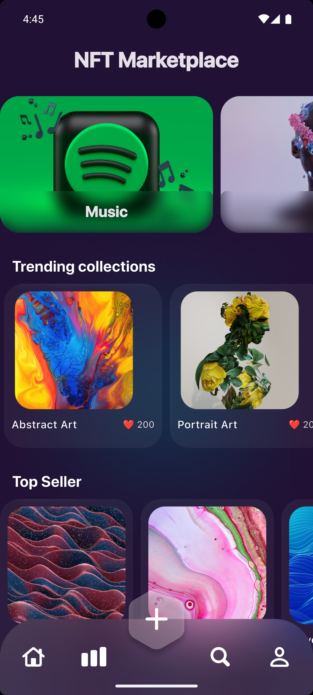
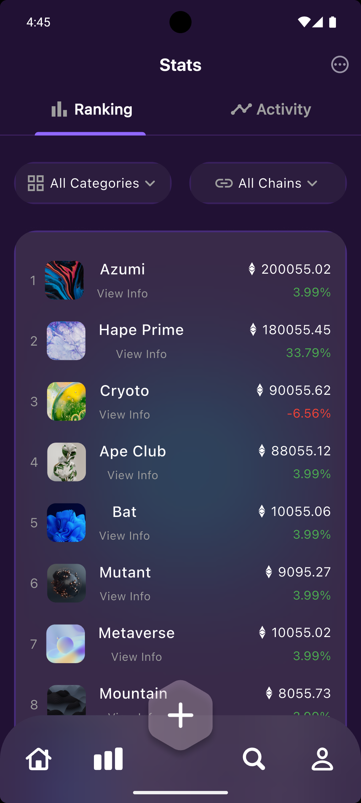

# Mini NFT Marketplace with Modern UI

A Flutter-based **NFT Marketplace** application with a sleek and modern UI design.  
This project showcases trending NFT collections, top sellers, and ranking stats with smooth navigation and custom UI components.

---

## ✨ Features
- Onboarding screen with custom fonts and assets  
- Home screen with:
  - Trending collections section  
  - Top sellers section  
  - Custom navigation bar with center docked floating action button  
- Stats screen with:
  - Ranking tab and activity tab  
  - Custom dropdown filters for categories and chains  
  - Ranking items with real-time data display  
- Dark modern UI theme with reusable components  

---

## 📸 Screenshots

### Home Screen


### Stats Screen


---

## 🛠️ Tech Stack
- [Flutter](https://flutter.dev/) (Dart)  
- Custom widgets and models  
- Clean architecture with managers for assets, colors, fonts, and strings  

---

## 📩 Contact
Yousef Sobhy – [LinkedIn](www.linkedin.com/in/yousef-sobhii16188328b)

## 🎨 Design

This app is based on the following Figma design:  
[Figma Design Link]([https://www.figma.com/file/your-design-link](https://www.figma.com/design/D2J9Jb4DMHnmgmXQ01FXH8/NFT-Marketplace?node-id=60-543&t=cbgkzREMWbMTRpwW-1))


## 🚀 Getting Started
1. Clone this repository  
   ```bash
   git clone https://github.com/your-username/mini-nft-marketplace.git
